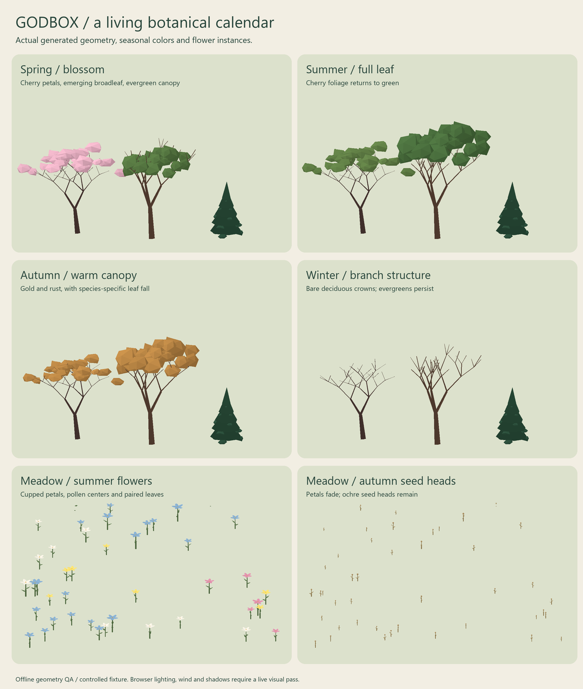

# Tree and flowering review

Trees now share one seasonal, climate-aware rendering path. Spring cherries bloom briefly, become green in summer, and turn gold/rust in autumn. Cold deciduous trees lose their crowns; evergreen and warm-climate exceptions remain. Conifers and alpine trees have tapered leaders and layered branch whorls. Wildflowers grow in small colonies with related colors, cupped petals, paired leaves, pollen centers, and persistent autumn seed heads.



This is a software render of actual generated geometry and instance colors, using a controlled temperate fixture. It does not validate browser lighting, WebGL shader compilation, shadows, or animation. Live browser inspection was stopped by the computer-use safety check because it could not confidently identify the current browser URL.

## Correctness fixes

- **Missing ancient trees:** the planner could choose variant 2 while the ancient library only contained variants 0 and 1. Every family now supplies the configured variant count.
- **Permanent pink canopies:** weather tint overwrote the cherry seasonal tint, and pink vertex colors prevented a true summer green. Geometry now carries neutral shading and phenology supplies absolute colors from one species palette.
- **Distance changes:** near/far meshes grow the same seeded skeleton and crown layout. Distance reduces detail without generating a different tree. Needle trees retain the same leader and branch layers.
- **Ground placement:** forest, managed trees and flowers reject coordinates beyond the rendered terrain. Forest sampling visits cells in seeded shuffled order so a full budget does not truncate one side of the map. Flower planning honors a zero budget.
- **Flower lifecycle:** size and bloom are continuous at growth-stage boundaries. Petals and seed heads use separate instance pools, so autumn seeds remain after petals fall. Winter, frost, snow, flooding, building footprints and distance suppress visible flowers.
- **Clearing and recovery:** active building footprints also exclude managed trees. Released land starts young, including woodland exposed by a shrinking town. Significant ancient trees that survive clearing retain their lifecycle when the town is abandoned.
- **Windthrow persistence:** observed damage remains in presentation placement data after transient weather scars disappear. Ordinary trees re-establish after a fallen period; an ancient tree's identity is never recycled.
- **Calendar initialization:** resume and large time jumps initialize the displayed season immediately; winter flower dormancy follows the authoritative calendar. Age-class labels retain their meaning while tree size grows smoothly between them.
- **Integration:** removed the decorative blossom-tree method and its prototype monkey patch. Local falling petals originate from flowering trees; global ambient particles are subtle neutral motes.
- **Diagnostics/resources:** placement checks read the actual forest. Draw-call estimates count active instance pools. Instance buffers are disposed when the renderer shuts down.

## Validation

The focused tree/flower suite passes 29 tests, covering real instance matrices/colors and geometry, lifecycle continuity, deterministic planning, all variants, cheaper LODs, three generated worlds, terrain boundaries, weather/occupancy suppression, season jumps, windthrow persistence, ancient-tree survival, and no simulation-state mutation by rendering.

Typechecking, ESLint and the production build pass. Vite still reports its existing large-chunk advisory.

The full repository suite reports **209 passing tests and one unrelated failure** in `tests/people.test.ts`, “clusters work and gathering destinations around the shared city plan.” It reproduces on the untouched baseline commit `a81bc6a` with the exact same values: distance `7.207182743222201` exceeds `1.5568135227489472`. This review leaves that separate people-navigation issue unchanged.

Reproduce the focused tests and offline preview:

```sh
npm test -- tests/vegetation-render.test.ts tests/forest-lifecycle.test.ts tests/flower-field.test.ts
npx tsx tests/vegetation-preview.ts
python scripts/render-vegetation-preview.py
```

Vegetation remains a presentation reader of the simulation. It does not add a new authoritative botanical simulation or change demographic, weather, economic, or historical outcomes. Recovery requires the renderer to observe a disturbance; expired historical storms cannot be reconstructed from unavailable records during a late resume.
