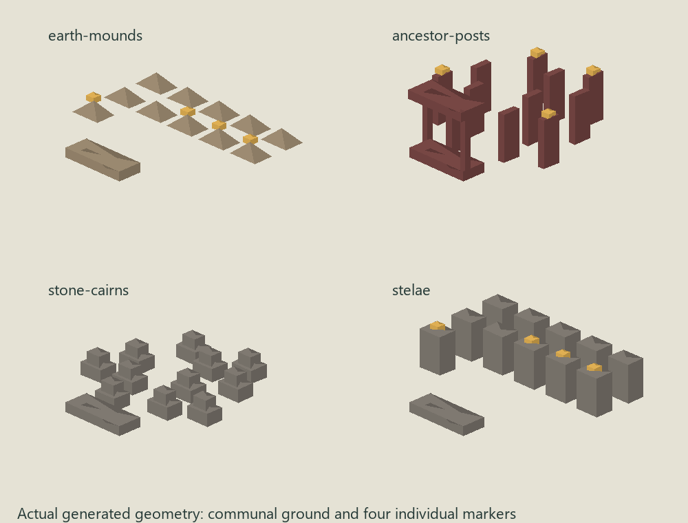

# Persistent cultural and memorial sites

Deaths and significant local events now leave settlement-owned remembrance records. These survive historian event eviction and normal state serialization. Development turns that evidence into a paid, terrain-validated memory structure in the existing sacred district. Existing roads and sacred anchors determine its neighborhood; the reserved plot remains fixed as the settlement expands.

- Explicit mortality counts each real death once. Represented kin with family ties or traditional values can receive an individual marker; historically notable people can also be retained.
- Each cultural layer retains at most eight permanent names (ordinary kin use at most four), four event references with summaries, and one aggregate death count. It occupies one shared site rather than a plot for each death. Geometry grows logarithmically to twelve communal marks, plus the named markers.
- Statistical counts use existing survival mortality and shock casualties. Documentary agent deaths can retain notable identities but do not add casualties again. The model exposes net demographic growth, not a separate baseline statistical death rate; this pass does not invent that rate.
- Religious tendency, hierarchy, long-term orientation, local stone availability, and founding cultural style select ancestor posts, stelae, cairns, or earth mounds. Sacred memorials supply the existing religion service and therefore participate in existing shrine destinations and worship schedules.
- Completion events include remembered names, event references, burial counts, and site form. Original death/event IDs remain construction causes, allowing historian consumers to follow the evidence without generating a new narrative authority.
- Completed sites keep their founding culture and cannot be automatically repurposed. New cultures can establish another layer. Age advances in 25-year bands, changes weathering, and qualifies the site for existing structure heritage. Abandoned settlements still allow normal decay into ruins.

## Landscape presentation

Memorials now read as settlement-scale places rather than isolated marker meshes. The simulation remains authoritative for mortality, culture, construction, plot reservation and age; the renderer derives a bounded precinct from those facts.

- The reserved memorial footprint receives terrain-following ground treatment, an entrance and a bounded cultural edge. Nothing flattens or replaces the simulation terrain.
- A pedestrian path is routed from the settlement circulation zone toward the memorial through the same dry-ground walkability contract used by represented people. Existing structures are treated as obstacles, and the path is omitted if a sensible route is unavailable.
- Earth mounds become irregular burial fields, ancestor posts become grove-like precincts, cairns gain rough stone edges, and stelae form more ordered courts. This is landscape language, not a second cultural authority.
- Age bands now change more than surface weathering. Older sites accumulate trees, shrubs and edge density, so an ancient cemetery can remain legible from settlement-level documentary shots without increasing the number of simulated burials.
- Presentation remains bounded: one landscape precinct per memorial plot, a small number of edge elements and vegetation instances, and short terrain-following path tiles. The renderer never expands aggregate deaths into one grave per casualty.
- Every generated surface is marked for the existing weather presentation pipeline. The landscape is deterministic from plot identity, memorial form, age and condition and consumes no simulation randomness.

### Visual language pass

The precinct renderer now treats the four memorial forms as different places rather than differently coloured markers.

- Earth-mound sites receive irregular terrain-following burial mounds, head/foot stones, organic row variation and a low earthen commemorative focus.
- Ancestor sites use carved timber posts, varied crowns and shoulders, stronger gate silhouettes, grove-like vegetation and multi-post event focuses.
- Cairn sites use deterministic stacked irregular stones for both individual marks and boundaries, with larger commemorative stacks for remembered events.
- Stela sites use stepped bases, upright slabs, caps, axial organization and a stronger central monolith.
- Age and condition physically affect presentation through lean, edge irregularity, litter, moss-like ground accents, vegetation density and material weathering. Ancient sites therefore read as old from shape and landscape history rather than only from colour.
- The building asset is now a bounded ceremonial focal composition while the terrain presentation owns distributed burial markers. This avoids double-counting simulation deaths while making the site legible at both close and settlement camera distances.
- Terrain patches use deterministic vertex-colour breakup and irregular edges while continuing to sample the authoritative elevation field. The visual pass never flattens terrain or writes back into simulation state.

### Archaeological layering and cultural succession

Memorial presentation now derives a bounded `MemorialComposition` from the authoritative site rather than treating the cemetery as one timeless visual state.

- Founding fabric, aggregate communal remembrance, named lives, and remembered events are ordered chronologically and compressed into at most four archaeological strata.
- Significant remembered events retain their original event type and significance alongside the existing id, summary, and month. That provenance survives normal historian event eviction, so a battle, pandemic, catastrophe, founding, war ending, or recovery can leave a different physical trace without reconstructing history later.
- Named lives can leave small inscription fragments keyed to their retained person id, name, and month. This remains capped by the existing eight-name archive limit.
- Remembered events can leave up to four bounded relic compositions. Battles use broken opposing slabs, pandemics and harvest crises use clustered stones, catastrophes use displaced/fallen fabric, settlement founding uses a threshold form, and war endings/recoveries use paired commemorative stones.
- Strata are deterministic from retained evidence, plot identity, age, condition, and founding culture. Older bands sit as partial, weathered remnants rather than pristine duplicate monuments.
- When a settlement contains memorials from successive cultures, each precinct receives an explicit succession ordinal and the landscape exposes the ordered cultural sequence. The original site remains fixed and ages in place while later cultures build their own separately styled memorial grounds.
- Current culture share is observational only. An old cemetery can therefore read as a legacy culture layer even when that culture is no longer dominant, without rewriting its founding form or ownership history.
- Documentary depth and archaeology fingerprints are presentation metadata only. They provide stable seams for camera, historian, inspection, or future archaeology systems without adding new simulation authority.

### Mourning and visitation behavior

Memorials are now semantic destinations distinct from shrines. A non-sacred burial ground can therefore receive mourners without becoming a religious building, while ordinary worship continues to use religion-service destinations.

- Existing personal loss memories drive attendance. Close family and lost mentors can trigger an immediate mourning visit when a built memorial site exists.
- Recent grief produces bounded, deterministic evening visits whose cadence is influenced by relationship strength already encoded in the memory plus loyalty, empathy, and cultural tradition.
- Strong personal memories can produce anniversary remembrance for up to ten years without keeping residents permanently attached to the cemetery.
- Priests and ritual specialists can lead communal remembrance for recent significant deaths, battles, pandemics, catastrophes, war endings, and recoveries already present in retained history.
- Memorial attendance uses the normal PeopleSystem route authority. The renderer can therefore photograph the walk to the cemetery, arrival, focal gathering, quiet reflection, offerings, and departure without creating a separate funeral simulation clock.
- `mourn` is a distinct activity and `memorial-site` is a distinct destination. Ordinary mourners use reflective choreography; ritual specialists use the existing ritual animation vocabulary.
- Memorial groups are focal rather than conversational. The presentation system arranges attendants around the site without treating a funeral as a market/plaza social mixer or mutating relationship state.

Construction retains normal labor, material, project, placement, and 96-plot settlement limits. When blocked, evidence remains pending. Later mortality updates a site's aggregate representation within its reserved ground; this is symbolic growth, not a simulated physical capacity or a new funeral economy. Named retention is bounded, so later ordinary lives contribute to collective memory rather than replacing older markers. Legacy saves initialize the optional fields as new evidence arrives; there is no speculative historical backfill.

Regression coverage includes death deduplication, notable documentary deaths, aggregate mortality, event retention, paid construction, blocked terrain, cultural succession, fixed plots, serialization, aging, deterministic replay, bounded geometry/cache changes, cultural landscape differentiation, age-driven vegetation and presentation-state immutability. Existing historian, advanced simulation, personal-memory, placement, and structure-rendering suites also pass. The settlement-development suite's nine existing failures were reproduced on clean HEAD (material-processing conservation and an invalid-terrain stock assertion).
